# Project 2: Pokédex

## Index
* [Overview](./README.md#overview)
* [Brief](./README.md#brief)
* [Technologies Used](./README.md#technologies-used)
* [Approach](./README.md#approach)
	* [Mockup](./README.md#mockup)
	* [Requesting Data from the API](./README.md#requesting-data-from-the-api)
	* [Displaying Details of Individual Pokémon](./README.md#displaying-details-of-individual-pokémon)
	* [Styling and Animation](./README.md#styling-and-animation)
    * [Background](./README.md#background)
    * [Hover Effects](./README.md#hover-effects)
    * [Animation for Pokémon Entering the Page](./README.md#animation-for-pokémon-entering-the-page)
* [Notable Bugs](./README.md#notable-bugs)  
* [Final Thoughts](./README.md#final-thoughts)
	* [Wins and Challenges](./README.md#wins-and-challenges)
	* [Key Learnings](./README.md#key-learnings)

<br/>
<br/>

Click <a href="https://masa-pokedex.netlify.app/" target="_blank">here</a> to see project.

<br/>

## Overview 
This was the second project I did at General Assembly's Software Engineering Immersive Course - we had 48 hours to create a web app in pairs. We chose to make a Pokédex featuring the 151 first generation Pokémon, using [PokéAPI](https://pokeapi.co/). Users can click on the Pokémon sprites to display details about them such as their evolution chain and battle stats.

I had only just learnt React, and this was also the first time I had coded a project with someone else. I mainly worked on styling and animating the page, but I will also explain the logic behind the API requests and filters since I also contributed to these elements. Since we were taking the course remotely, we used Live Share on VS Code to pair code.


<br/>

## Brief
* To make a web app using React, using at least one external API, within 48 hours.


<br/>

## Technologies Used
* HTML5
* CSS3 with animation
* JavaScript (ES6)
* React
* Insomnia
* Bulma
* Git
* GitHub
* Adobe Fonts
* Google Chrome dev tools
* VS Code
* Eslint
* Photoshop
* Illustrator


<br/>


## Approach
### Mockup

Since we were working in pairs, we first started by sketching out a mockup. It was useful for calibrating our vision of the final product.

<p align="center">
	  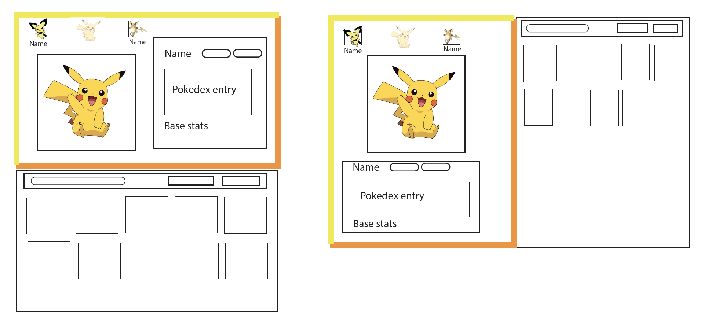
</p>

There were two ideas for the layout, but we settled on having the index of the Pokémon displayed on the right, and section on the left to show each Pokémon when they are selected. The colours used in the page border would change depending on the selected Pokémon's type. 

<br/>

### Requesting Data from the API

First step was to get the data from the PokéAPI so that it could be manipulated. This was more difficult than originally anticipated, since the PokéAPI is vast, and has many subsections. To get all the data we needed, we had to make two requests - first to retrieve the URL of the 151 Pokémon, then a second request using these URLs to retrieve data for each Pokémon.

Initial attempt (below) involved getting each Pokémon's URL, then making request for each of them using `forEach`. Requested information was then pushed into an array, so that it could be set to state (note that for testing purpose, request was only made for 5 Pokémon at this point).

```js
  React.useEffect(() => {
    const getData = async () => {
      try {
        const { data: { results } } = await axios.get('https://pokeapi.co/api/v2/pokemon?limit=5')
        const pokemonsArray = []
        results.forEach(async pokemon => {
          console.log(pokemon.url)
          const { data } = await axios.get(pokemon.url)
          pokemonsArray.push(data)
        })
        console.log('pokemonarray',pokemonsArray)
        setPokemons(pokemonsArray)
      } catch (err) {
        console.log(err)
      }
    }
    getData()
  }, [])
  ```

  This approach did not work, because 'pokemonArray' was being set to state before the request was complete, which meant a blank array was set to state. This can be seen in the screenshot of the console log below (results were displayed when the array was clicked, but these results were only evaluated when it was clicked).

  <p align="center">
	  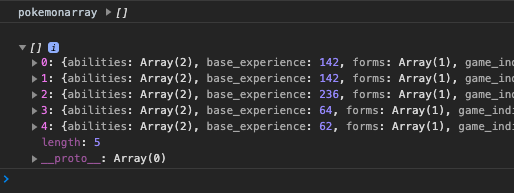
  </p>

  This was a major blocker, but eventually resolved by using `Promise.all` to ensure that requests were only set to state after they were all completed.

  ```js
   React.useEffect(() => {
    const getData = async () => {
      try {
        const { data: { results } } = await axios.get('https://pokeapi.co/api/v2/pokemon?limit=151')
        const requestsArray = results.map(pokemon => {
          return axios.get(pokemon.url)
        })
        const response = await Promise.all(requestsArray)
        const pokemonsArray = response.map(res => res.data)
        setPokemons(pokemonsArray)
      } catch (err) {
        console.log(err)
      }
    }
    getData()
  }, [])
```

Once the data was retrieved, it was relatively easy to map them onto the page. API had links to many kinds of sprite images, but sprites from Pokémon Emerald was picked since it had nice resolution and colours.

  <p align="center">
	  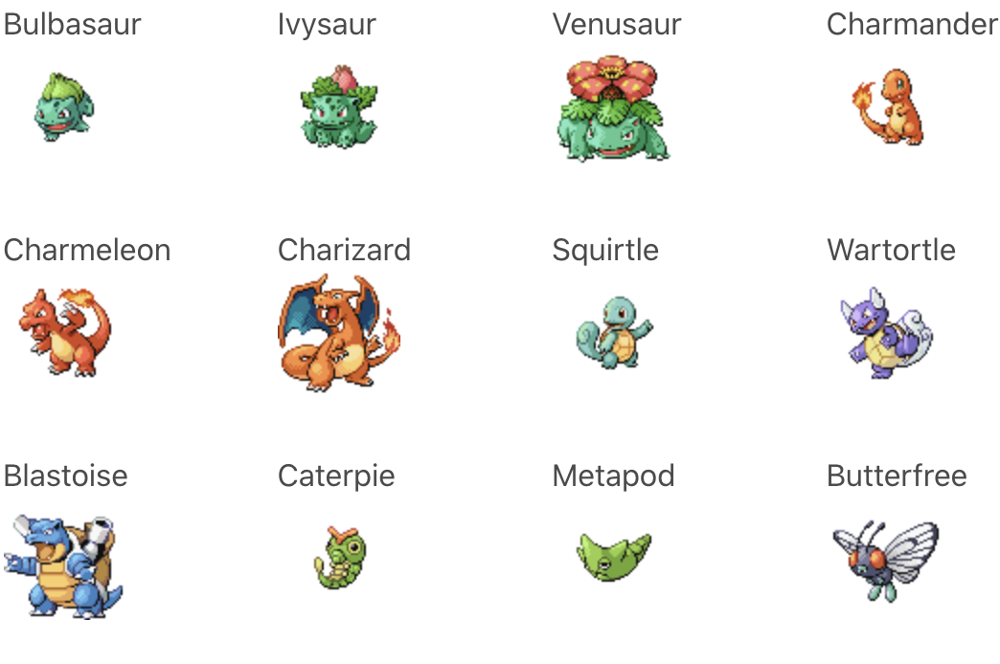
  </p>

<br/>

### Displaying Details of Individual Pokémon

There were several information to be displayed when individual Pokémon were selected, which were:

*  Name
*  Type(s)
*  Evolution Chain (what it evolves from and/or what it evolves to)
*  Pokédex entry (Pokémon's description)
*  Battle Stats (Hit Points, Speed etc)
*  Shiny sprite (rare alternative colour of the Pokémon)

This was tricky because these information were on different parts of the API, which were not availble in the data initially requested. So further API request was made once data for all Pokémon were available. By default, 'currentPokemon' was set as the first Pokémon in the data, which is Bulbasaur. To do this, 'currentPokemon' was set as the dependency array for `useEffect` below:


```js
  const speciesURL = 'https://pokeapi.co/api/v2/pokemon-species/'
  
  React.useEffect(() => {
    const getData = async () => {
      try {
        const { data: speciesData } = await axios.get(speciesURL + currentPokemon.name)
        const { data: evolutionData } = await axios.get(speciesData.evolution_chain.url)
        setCurrentSpecies(speciesData)
        setCurrentEvolutionChain(evolutionData)
      } catch (err){
        console.log(err)
      }  
    }
    getData()
  }, [currentPokemon])
  ```

  
  For the evolution chain, name and ID of each Pokémon belonging to the chain was necessary. Unfortunately, the PokéAPI did not have the information easily accessible, so it had to be edited in a roundabout way. There were no specific fields for ID in this part of the API, but since it was mentioned in the URL field, it was accessed by splitting this string (a bit messy but it worked!) 

  ```js
  currentEvolutionChain.chain.species.url.split('/')[6]
  ```

  Also, conditional flow was added to deal with the fact that not all Pokémons evolve twice (some only evolve once, some never, at least in the first version of the game). Pokémon's 'evolves_to' field's length was used to check if it evolved or not (if it did, the length would be more than 0). `For loop` was used to accomodate Eevee - if you are familiar with the game, you may know that Eevee evolves to several different Pokémon, so the 'evolves_to' field had to be looped through to display all of them.

  Also, since only 151 Pokémon from the first generation game were featured, the array was filtered in the end (some Pokémon had new evolution added in later versions of the game).

  ```js
    let evolutionChain = []
  if (currentEvolutionChain) {
    evolutionChain.push([currentEvolutionChain.chain.species.name,
      Number(currentEvolutionChain.chain.species.url.split('/')[6])])
    if (currentEvolutionChain.chain.evolves_to.length > 0) {
      for (let i = 0; i < currentEvolutionChain.chain.evolves_to.length; i++) {
        evolutionChain.push([currentEvolutionChain.chain.evolves_to[i].species.name,
          Number(currentEvolutionChain.chain.evolves_to[i].species.url.split('/')[6])])
      }
      if (currentEvolutionChain.chain.evolves_to[0].evolves_to.length > 0) {
        evolutionChain.push([currentEvolutionChain.chain.evolves_to[0].evolves_to[0].species.name,
          Number(currentEvolutionChain.chain.evolves_to[0].evolves_to[0].species.url.split('/')[6])])
      }
    }
    evolutionChain = evolutionChain.filter(stage => {
      return stage[1] <= 151
    })
  }
  ```
  
  <p align="center">
	  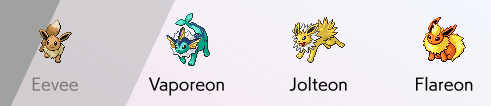
  </p>


<br/>

### Filters for the Pokémon Index

One input field and two select options were put in to enable users to filter and sort Pokémon displayed in the index.

The dropbox for type enabled users to choose one of 18 types, such as fire and water. Screenshots below shows the result of filtering fire and ground:

  <p align="center">
	  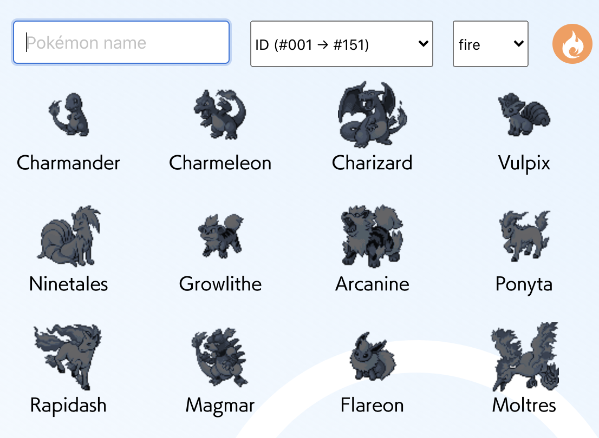
  </p>

  <p align="center">
	  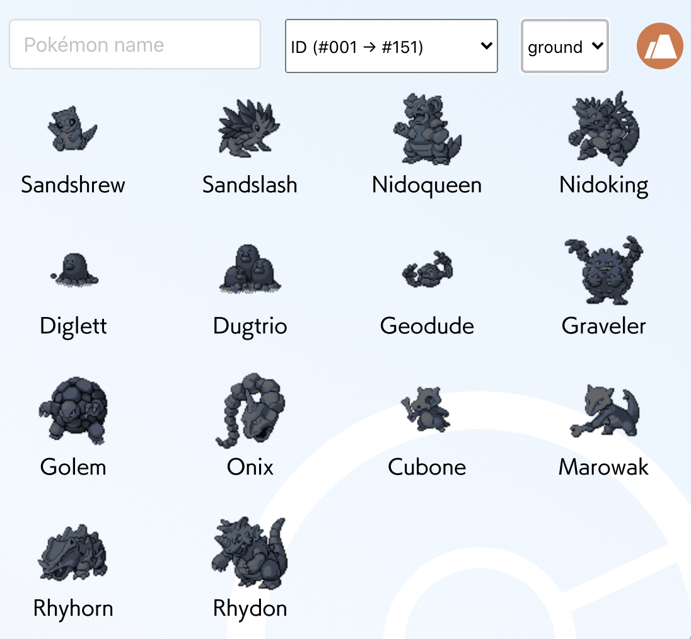
  </p>

One of the select boxes provides option to sort by ID numbers, height or weight, in either ascending or descending order. Screenshot below shows ground type Pokémon sorted by height (short to tall):

  <p align="center">
	  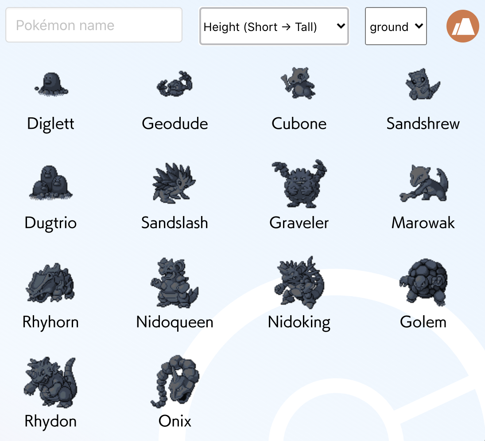
  </p>

The text input field could be used to filter by name. This could be used together with the select boxes. Screenshot below shows ground type Pokémon with 'nido' in their name:

  <p align="center">
	  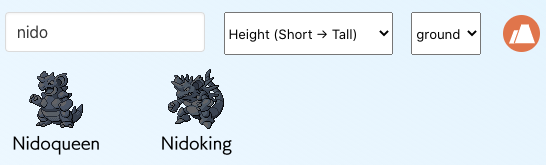
  </p>
  
Pokémon were filtered using conditional flow - first it checked if the 'searchTerm' entered in the text input field was included in the name, then it moved on to check the type selected in the drop down. If Pokémon has two types, both their first type and second type are checked. Users could also choose 'all' types, in which case Pokémon of all types would be shown.

```js
  const filteredPokemons = sortedPokemons ? sortedPokemons.filter(pokemon => {
    if (!pokemon.name.includes(searchTerm)) {
      return false
    }
    if (pokemon.types.length > 1) {
      if (pokemon.types[1].type.name === selectedType) {
        return true  
      }
    }
    return pokemon.types[0].type.name === selectedType || selectedType === 'all'
  }) : null
```

Before being filtered, the Pokémon array is sorted using function below. 

```js
  const handleSort = e => {
    const key = e.target.value.split('-')[0]
    const descending = e.target.value.split('-')[1] === 'descending'
    const pokemonsCopy = JSON.parse(JSON.stringify(pokemons))
    pokemonsCopy.sort((a, b) => (a[key] - b[key]) * (descending ? -1 : 1))
    setSortedPokemons(pokemonsCopy)
  }
```

A deep clone of the array was created using the JSON.parse(JSON.stringify(obj)) method - this is because the sort would mutate the pokemons array, affecting the order of the Pokémon displayed on other part of the web page. For example, screenshot below on the left shows the result of Pikachu without this workaround. When the index was sorted in order of weight (heavy to light), instead of showing Pikachu and Raichu in the evolution chain, it shows Slowbro and Golduck, because the data were jumbled up. The Screenshot on the right shows the corrected version:

  <p align="center">
	  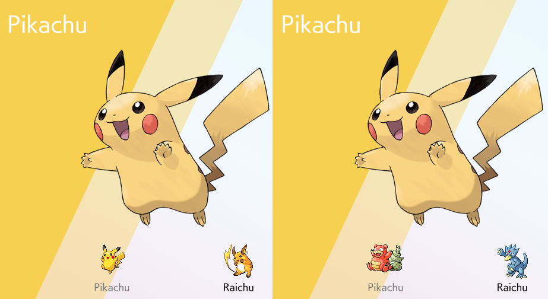
  </p>

I subsequently learned that deep cloning using JSON.parse and JSON.stringify is not considered to be best practice since it can break certain objects (as explained in  [this article](https://medium.com/@pmzubar/why-json-parse-json-stringify-is-a-bad-practice-to-clone-an-object-in-javascript-b28ac5e36521)), but it served the purpose for this project.

<br/>

### Styling and Animation

My main contribution for this project was styling and animation using CSS. I took inspiration from the Pokémon Sword and Shield Version on Nintendo Switch, which has an interface like below. I really liked the subtle shade of the background and the slanted background, so I used these as an inspiration. Colours for the 18 types were also sampled from the game by using colour picker on Photoshop.

  <p align="center">
	  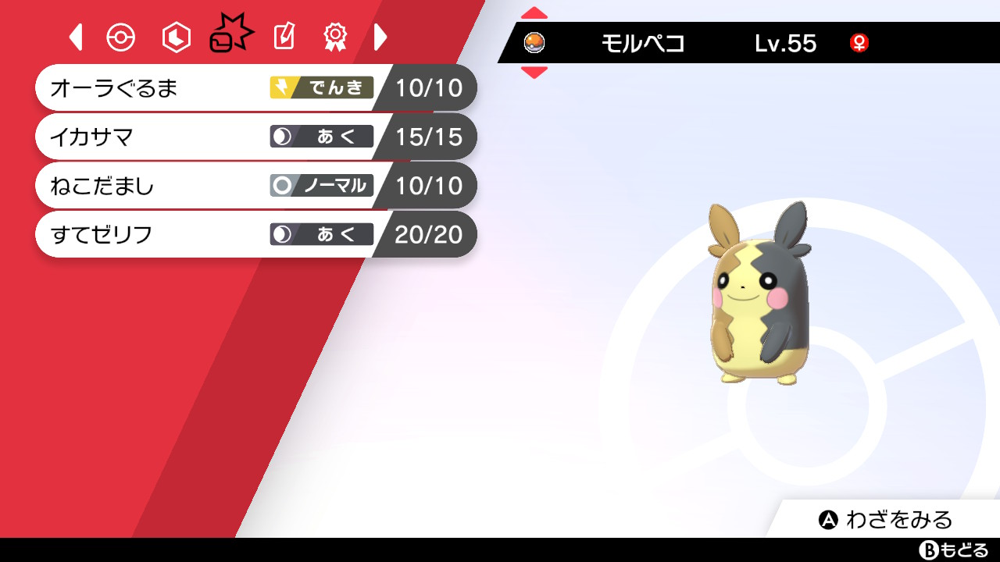
  </p>

<br/>

#### Background

The background shade was put together by layering together a div, coloured using `linear-gradient`. The diagonal shapes are also divs, rotated using `transform: rotate(25deg)`. These were conditionally rendered by referencing the selected Pokémon's type. The left hand side would refer to the first type, the right hand side the second type (if Pokémon only has one type, both background would be that type). For example, Vileplume shown below has the green from grass, and purple from poison type. 

 <p align="center">
	  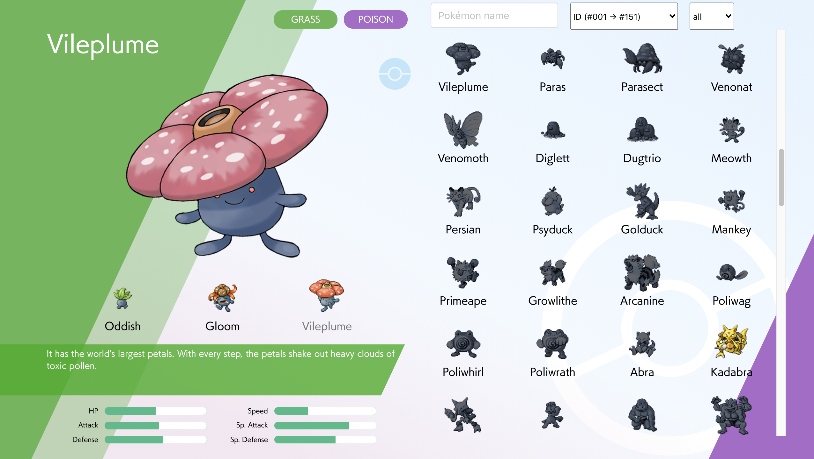
  </p>

The colour from the first type is also used in 3 other shades in the background: 
* The ligher colour is produced by adjusting the opacity. 
* The background for the Pokédex entry is slightly darkened by applying `filter: contrast(190%) brightness(75%)`.
* The stat bars has `filter: hue-rotate(30deg)` applied to alter the hue slightly, to make it stand out from the background.
By applying the colour based on the base colour, it helped maintain consistency, and saved me from hard coding them.


<br />

#### Hover Effects
  

  <p align="center">
	  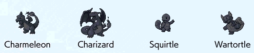
  </p>

By default, the sprites are displayed in a dark bluish tone, almost like a silhouette but the detail just about visible. This is styled by applying`filter: sepia(100) hue-rotate(180deg) brightness(40%)`. By applying the sepia and hue-rotate(180deg), it becomes a bluish colour. The brightness is lowered to make it darker. When the image is hovered, the filter is changed back to default by applying `filter: sepia(0) hue-rotate(0deg) brightness(100%)`. A 'bopping' motion was also added by applying keyframe animation:

```css
@keyframes bopping {
  0% { top: 0; }
  50% { top: -5px; }
  100% { top: 0; }
}
```

  <p align="center">
	  
  </p>

We also made a feature where the user could keep track of Pokémon they have caught by clicking on the Pokéball icon. On hover, the icon's opacity would change, and it would spin once. Keyframe animation below was used, but set to `forwards` so that it only animated once per hover. When clicked, the Pokéball icon would change to pink, again by using `hue-rotate`. 

```css
@keyframes rotating {
  0% { transform: rotate(0); }
  100% { transform: rotate(360deg); } 
}
```

Clicking on the Pokéball icon would also trigger a function called 'catchPokemon', which would record the selected Pokémon's ID into a state variable. The ID was also recorded onto the browser's local storage, which meant that the 'caught' status would persist even when the page was refreshed. Once Pokémon is 'caught', the sprite in the index would also be displayed without the dark shade. Idea was that the index would become more and more colourful as the user's collection grows. The 'caught' status can be cancelled by clicking on the Pokéball icon once more. You can see this in action in the screen capture below:

  <p align="center">
	  
  </p>

Screen capture above also shows that when the Pokéball icon is clicked, the Shiny version (alternative colour version) of the sprite is displayed on the top left. 

<br />

#### Animation for Pokémon Entering the Page
  
Each time a new Pokémon is selected, it comes in from left of the screen. This is triggered by adding the 'display' class. This class is controlled using state, as shown in the snippet below:

```js
    <div className={'pokedex-img' + pokedexImageDisplay}>
      
    </div>  
```                    

The 'display' class triggers the keyframe animation below. As well as changing the `margin-left` to move the image from left to right,` transform: scale` is applied to add a springy effect to the motion. The image is also tilted slightly using `transform: rotate`, which adds to this effect. 

```css
@keyframes slidein {
  0% { transform: scale(1); margin-left: -100%;}
  70% { transform: scale(0.95,1.05) rotate(10deg); margin-left: 10%; }
  80% { transform: scale(1.05,0.95);}
  90% { transform: scale(0.95,1.05) rotate(0deg); }
  100% { transform: scale(1); margin-left: 0; }
}
```

To trigger the animation each time a Pokémon is selected, the class is removed first using `setPokedexImageDisplay('')` (the class is conditionally attached like this: `className={'pokedex-img' + pokedexImageDisplay}`). Then, class is set again with `setPokedexImageDisplay(' display')`.

The variable 'pokedexImageDisplay' is also tied to the Pokéball icon. 

```js
   <div className={`pokeball-select
    ${caughtPokemons.includes(currentPokemon.id) ? ' activated' : ''}` + 
    pokedexImageDisplay}>
    
  </div>  
```         

Two keyframes, 'fadein' and 'rotating' is applied to the Pokéball icon when the 'display' class is added. The 'fadein' changes the opacity 0.5 seconds into the animation, to ensure that the Pokéball icon appears after the Pokémon is displayed on the page.

```css
.pokeball-select.display {
  animation: fadein forwards 1s, rotating forwards 1s;
  border-radius: 50%;
  overflow:hidden;
}

@keyframes fadein {
  0% { opacity:0; }
  50% { opacity:0; }
  100% { opacity:1; }
}
```
<br />

## Notable Bugs

As mentioned earlier in [Filters for the Pokémon Index](./README.md#filters-for-the-pokémon-index), some of our functions accidentally mutated the data, which caused unexpected results. The solution was to create a separate copy of the data to avoid mutating the original.

Another notable bug was that when new Pokémon were selected to be displayed, the display animation would trigger without waiting for the image to load fully. Screencapture below shows Pikachu re-entering the page when Sandshrew is selected:

  <p align="center">
	  
  </p>

As explained earlier, the display animation is controlled by adding and removing 'display' class on the element. The issue was, the class was being reattached using `setTimeout` using function below. This meant the animation would play 400 millisecond after the 
Pokémon is selected, which may not be long enough for the new image to load.

```js
  let timer
  const handlePokedexImgDisplay = () => {
    setPokedexImageDisplay('')
    clearTimeout(timer)
    timer = setTimeout(() => {
      setPokedexImageDisplay(' display')
    }, 400)
  }
```
<br />

The solution to this was to remove the function from the sprites' `onClick` event, and adding it to Pokémon image's `onLoad` event instead. This way, it would only fire when the new image is loaded:

```js
  
```

<br />

Also, `setPokedexImageDisplay('')` was removed from 'handlePokedexImgDisplay' and moved to the sprites' `onClick` event instead. Conditional flow was added to ensure that it would only fire when a Pokémon different to the one already displayed is selected. This was necessary because without the conditional flow, when Pokémon already on display is re-selected, the 'display' class will be removed but will no be reattached. This is because the Pokémon image's `onLoad` event will only trigger if a new image is loaded.

```js
   {
      setCurrentPokemon(pokemon)
      if (pokemon !== currentPokemon) setPokedexImageDisplay('')
    }} 
  />
```                      

<br />

Apart from this, we also encountered issues with some of the Pokémon's names. This was not exactly a bug, but an issue arising from how the names were formatted in the API. In the Pokémon game, there are two types of Nidoran - Nidoran &#9794; and Nidoran &#9792;. These appeared as 'nidoran-m' and 'nidoran-f' in the API, so the names had to be refactored to be displayed correctly. Mr. Mime also had a similar issue, since it was spelt mr-mime in the API (I guess the names had to be formatted in such ways to be stored in the database). As a workaround, we had a function to reformat these names:

``` js
function formatName(name) {
  if (name[name.length - 2] === '-') {
    if (name.includes('-f')) {
      return name.replace('-f', '\u2640')
    } else {
      return name.replace('-m', '\u2642')
    }
  } else {
    return name.replace('-', '. ')
  }
}
```

<br />

## Final Thoughts

### Wins and Challenges
This was my first time to make a website in pairs, and I was also still relatively new to working with React and API, so there was a lot to take in. On top of this we only had 48 hours so it was a major undertaking. 

It took a while to get started because we had to first calibrate our ideas, but the process helped refine the concept, and in the end I was able to achieve much more than I could on my own. I felt that splitting the task worked well, because I was able to focus a lot on styling and animating. 

We chose to use Bulma for some of the CSS. I found myself fighting against Bulma at times, but it was useful for getting certain things into shape quickly, particularly the stat bars and form fields. Having said this, if I were to make something similar in the future, I would probably write my own CSS to have better control.

<br />

### Key Learnings
The collaboration aspect of the project meant that I had to verbalise my thoughts, which I found difficult to begin with, but I am sure the skill would be invaluable in a real life coding environment. I also learned the benefit of splitting the app into different components, because it made it easier to work on separate areas of the website simultaneously. 

The PokéAPI was so rich in data and fun to work with, but it was also quite tricky to get the data we wanted. It made me think about how APIs could be structured, bearing in mind how the user might want to access the data. 

Click <a href="https://masa-pokedex.netlify.app/" target="_blank">here</a> to see project.

 <p align="center">
	  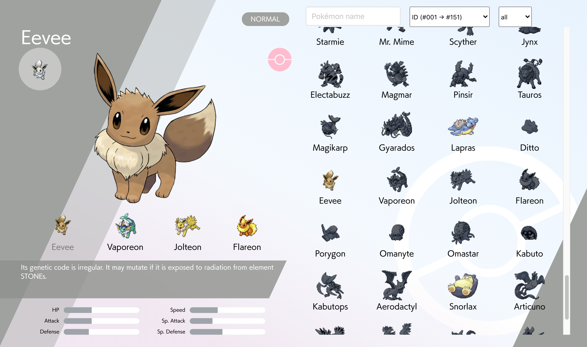
  </p>

   <p align="center">
	  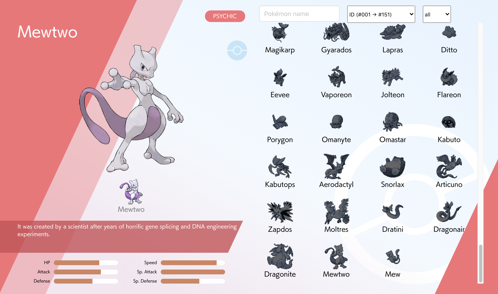
  </p>